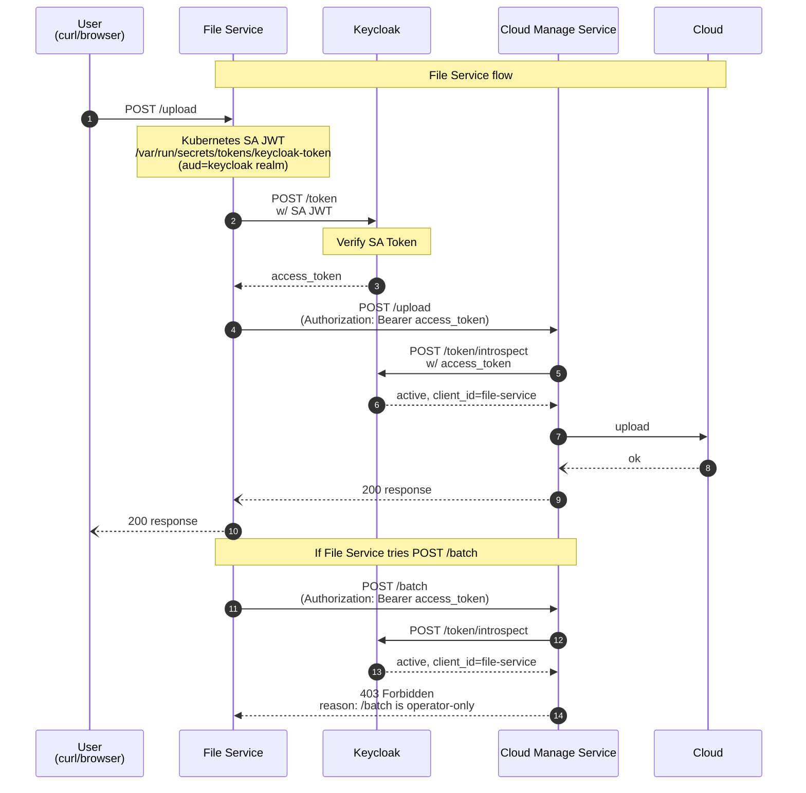

# keycloak-preview

This is a playground example that demonstrates federated client authentication in Keycloak using Kubernetes Service Account Tokens, based on the January 2026 Keycloak update: https://www.keycloak.org/2026/01/
federated-client-authentication


This chart deploys:
- Keycloak
- File Service (client)
- Operator Service (client)
- Cloud Manager Service (token introspection + API guard)

## Repository Layout

```text
.
├── helm/
│   ├── Chart.yaml
│   ├── values.yaml
│   └── templates/
│       ├── namespace.yaml
│       ├── serviceaccount.yaml
│       ├── keycloak-statefulset.yaml
│       ├── keycloak-service.yaml
│       ├── cloud-manager-deployment.yaml
│       ├── cloud-manager-service.yaml
│       ├── file-service-deployment.yaml
│       ├── file-service-service.yaml
│       ├── operator-service-deployment.yaml
│       ├── operator-service-service.yaml
│       └── secrets.yaml
├── client/
├── server/
└── README.md
```

## Prerequisites

- Kubernetes cluster (kind/minikube/managed)
- Helm v3+
- kubectl

## Quick Start

```bash
# 1) Lint
helm lint ./helm

# 2) Install
helm upgrade --install keycloak-preview ./helm \
```

## Check Deployment

```bash
helm status keycloak-preview

kubectl get all -n keycloak
kubectl get all -n cloud-manager-team
kubectl get all -n dev-file-manage-team
kubectl get all -n dev-operator-team
```

## Service Endpoints (default NodePorts)

- Keycloak: `http://localhost:30080`
- Cloud Manager: `http://localhost:30081`
- Operator Service: `http://localhost:30082`
- File Service: `http://localhost:30083`

## Current Runtime Flow

1. File/Operator service reads projected SA token (`/var/run/secrets/tokens/keycloak-token`)
2. Service requests Keycloak access token with `client_credentials + client_assertion`
3. Service calls Cloud Manager with `Authorization: Bearer <access_token>`
4. Cloud Manager introspects token at Keycloak `/token/introspect`
5. Cloud Manager allows APIs by parsed `client_id`

Policy in current server logic:
- `system:serviceaccount:dev-file-manage-team:sa-file-service` -> `/upload`
- `system:serviceaccount:dev-operator-team:sa-operator-service` -> `/batch`

## Key Settings (`helm/values.yaml`)

```yaml
global:
  keycloakHostname: "http://localhost:30080"
  keycloakInternalUrl: "http://keycloak.keycloak.svc"
  keycloakRealm: "Test"
  saTokenAudience: "http://localhost:30080/realms/Test"

keycloak:
  admin:
    username: admin
    password: "<set-at-install-time>"

cloudManager:
  config:
    introspectClientId: "cloud-manager-service"
    introspectClientSecret: "<set-at-install-time>"
```

Important:
- `global.saTokenAudience` must match the Keycloak realm issuer URL expected for SA JWT audience validation.
- If your realm is `master`, update both `keycloakRealm` and `saTokenAudience` accordingly.

## Recommended Secret Injection

Avoid storing real credentials in Git-tracked files.

```bash
helm upgrade --install keycloak-preview ./helm \
  -n helm --create-namespace \
  --set keycloak.admin.password="$KEYCLOAK_ADMIN_PASSWORD" \
  --set cloudManager.config.introspectClientSecret="$CLOUD_MANAGER_CLIENT_SECRET"
```

## Basic Tests

```bash
# File service token info
curl http://localhost:30083/token-info

# Upload path (File Service -> Cloud Manager)
curl -X GET http://localhost:30083/upload

# Operator path  (Operator Service -> Cloud Manager)
curl -X GET http://localhost:30082/batch
```
#### File Service



## Troubleshooting

### 1) `invalid_client: Invalid token audience`

Your projected token `aud` does not match Keycloak expected audience.

Check:
```bash
curl http://localhost:30083/token-info
```

Fix:
- Update `global.saTokenAudience` in `helm/values.yaml`
- Re-deploy and recreate pods

```bash
helm upgrade --install keycloak-preview ./helm -n helm
kubectl -n dev-file-manage-team rollout restart deploy/file-service
kubectl -n dev-operator-team rollout restart deploy/operator-service
```

### 2) Introspection failure

```bash
kubectl logs -n cloud-manager-team deployment/cloud-manager-service
```

