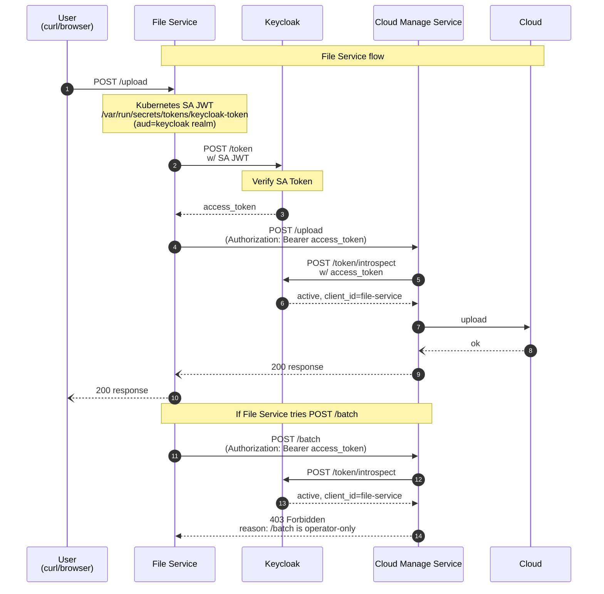

# keycloak-preview

This is a playground example that demonstrates federated client authentication in Keycloak using Kubernetes Service Account Tokens, based on the January 2026 Keycloak update: https://www.keycloak.org/2026/01/federated-client-authentication


This chart deploys:
- Keycloak
- File Service (client)
- Operator Service (client)
- Cloud Manager Service (token introspection + API guard)

## Repository Layout

```text
.
├── helm/
│   ├── Chart.yaml
│   ├── values.yaml
│   └── templates/
│       ├── namespace.yaml
│       ├── serviceaccount.yaml
│       ├── keycloak-statefulset.yaml
│       ├── keycloak-service.yaml
│       ├── cloud-manager-deployment.yaml
│       ├── cloud-manager-service.yaml
│       ├── file-service-deployment.yaml
│       ├── file-service-service.yaml
│       ├── operator-service-deployment.yaml
│       ├── operator-service-service.yaml
│       └── secrets.yaml
├── client/
├── server/
└── README.md
```

## Prerequisites

- Kubernetes cluster (kind/minikube/managed)
- Helm v3+
- kubectl

## Quick Start

Install K8s cluster
```bash
kind create cluster --config kind-config.yaml --name keycloak-cluster
```


### Deploy using Helm Chart

#### Key Settings (`helm/values.yaml`)

```yaml
global:
  keycloakHostname: "http://localhost:30080"
  keycloakInternalUrl: "http://keycloak.keycloak.svc"
  keycloakRealm: "<YOUR_REALM>"
  saTokenAudience: "http://localhost:30080/realms/<YOUR_REALM>"

keycloak:
  admin:
    username: admin
    password: "<set-at-install-time>"

cloudManager:
  config:
    introspectClientId: "cloud-manager-service"
    introspectClientSecret: "<set-at-install-time>"
```

Important:
- `global.saTokenAudience` must match the Keycloak realm issuer URL expected for SA JWT audience validation.
- If your realm is `master`, update both `keycloakRealm` and `saTokenAudience` accordingly.

#### Install using helm chart
```bash
helm upgrade --install keycloak-preview ./helm
```

#### Check Deployment

```bash
helm status keycloak-preview

kubectl get all -n keycloak
kubectl get all -n cloud-manager-team
kubectl get all -n dev-file-manage-team
kubectl get all -n dev-operator-team
```

#### Keycloak Setting using bash automatically

Please run this after the Keycloak pod is fully up and running.

```bash
./keycloak-setup.sh http://localhost:30080 Test admin changeme

# keycloak-setup.sh <keycloak_url> <realm> [admin_username] [admin_password]
```


## Service Endpoints (default NodePorts)

- Keycloak: `http://localhost:30080`
- Cloud Manager: `http://localhost:30081`
- Operator Service: `http://localhost:30082`
- File Service: `http://localhost:30083`

## Current Runtime Flow

1. File/Operator service reads projected SA token (`/var/run/secrets/tokens/keycloak-token`)
2. Service requests Keycloak access token with `client_credentials + client_assertion`
3. Service calls Cloud Manager with `Authorization: Bearer <access_token>`
4. Cloud Manager introspects token at Keycloak `/token/introspect`
5. Cloud Manager allows APIs by parsed `client_id`

Policy in current server logic:
- `system:serviceaccount:dev-file-manage-team:sa-file-service` -> `/upload`
- `system:serviceaccount:dev-operator-team:sa-operator-service` -> `/batch`


## Basic Tests

```bash
# File service token info
curl http://localhost:30083/token-info

# File Service gateway endpoints
curl -X GET http://localhost:30083/upload  # Success
curl -X GET http://localhost:30083/batch   # Rejected from Cloud Manager service

# Operator Service gateway endpoints
curl -X GET http://localhost:30082/batch   # Success
curl -X GET http://localhost:30082/upload  # Rejected from Cloud Manager service
```


#### File Service


## Delete Resources

```bash
kind delete cluster --name keycloak-cluster       
```

## Troubleshooting

### 1) `invalid_client: Invalid token audience`

Your projected token `aud` does not match Keycloak expected audience.

Check:
```bash
curl http://localhost:30083/token-info
```

Fix:
- Update `global.saTokenAudience` in `helm/values.yaml`
- Re-deploy and recreate pods

```bash
helm upgrade --install keycloak-preview ./helm -n <release-namespace>
kubectl -n dev-file-manage-team rollout restart deploy/file-service
kubectl -n dev-operator-team rollout restart deploy/operator-service
```

### 2) Introspection failure

```bash
kubectl logs -n cloud-manager-team deployment/cloud-manager-service
```
